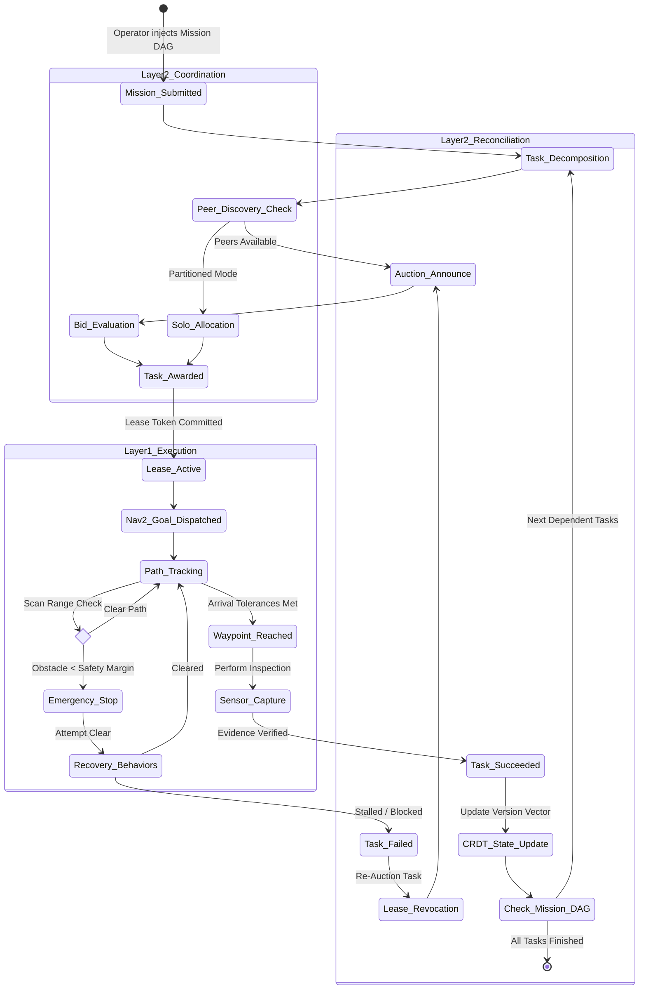

# Control Flow Architecture

## 1. Lifecycle and Execution Control Flow

The control loop transitions from declarative mission specifications down to hard real-time motor actuation:

```mermaid
stateDiagram-v2
    [*] --> Mission_Submitted: Operator injects Mission DAG

    state Layer2_Coordination {
        Mission_Submitted --> Task_Decomposition
        Task_Decomposition --> Peer_Discovery_Check
        Peer_Discovery_Check --> Auction_Announce: Peers Available
        Peer_Discovery_Check --> Solo_Allocation: Partitioned Mode
        Auction_Announce --> Bid_Evaluation
        Bid_Evaluation --> Task_Awarded
        Solo_Allocation --> Task_Awarded
        Task_Awarded --> Lease_Active: Lease Token Committed
    }

    state Layer1_Execution {
        Lease_Active --> Nav2_Goal_Dispatched
        Nav2_Goal_Dispatched --> Path_Tracking
        state Safety_Monitor <<choice>>
        Path_Tracking --> Safety_Monitor: Scan Range Check
        Safety_Monitor --> Emergency_Stop: Obstacle < Safety Margin
        Safety_Monitor --> Path_Tracking: Clear Path
        Emergency_Stop --> Recovery_Behaviors: Attempt Clear
        Recovery_Behaviors --> Path_Tracking: Cleared
        Recovery_Behaviors --> Task_Failed: Stalled / Blocked
        Path_Tracking --> Waypoint_Reached: Arrival Tolerances Met
        Waypoint_Reached --> Sensor_Capture: Perform Inspection
        Sensor_Capture --> Task_Succeeded: Evidence Verified
    }

    state Layer2_Reconciliation {
        Task_Succeeded --> CRDT_State_Update: Update Version Vector
        Task_Failed --> Lease_Revocation: Re-Auction Task
        Lease_Revocation --> Auction_Announce
        CRDT_State_Update --> Check_Mission_DAG
        Check_Mission_DAG --> [*]: All Tasks Finished
        Check_Mission_DAG --> Task_Decomposition: Next Dependent Tasks
    }
```
