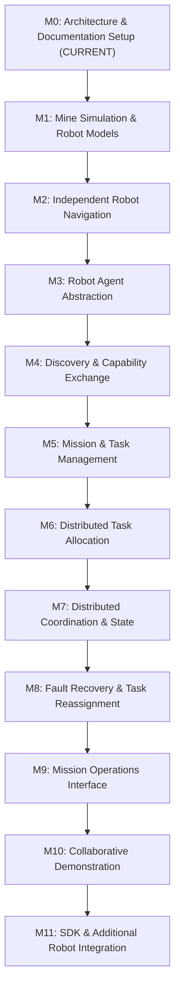

# Development Roadmap

The platform development is structured into 12 sequential milestones (M0 through M11) adhering strictly to the documentation-first engineering rule:

```mermaid
flowchart TD
    M0["M0: Architecture & Documentation Setup (CURRENT)"] --> M1["M1: Mine Simulation & Robot Models"]
    M1 --> M2["M2: Independent Robot Navigation"]
    M2 --> M3["M3: Robot Agent Abstraction"]
    M3 --> M4["M4: Discovery & Capability Exchange"]
    M4 --> M5["M5: Mission & Task Management"]
    M5 --> M6["M6: Distributed Task Allocation"]
    M6 --> M7["M7: Distributed Coordination & State"]
    M7 --> M8["M8: Fault Recovery & Task Reassignment"]
    M8 --> M9["M9: Mission Operations Interface"]
    M9 --> M10["M10: Collaborative Demonstration"]
    M10 --> M11["M11: SDK & Additional Robot Integration"]
```
